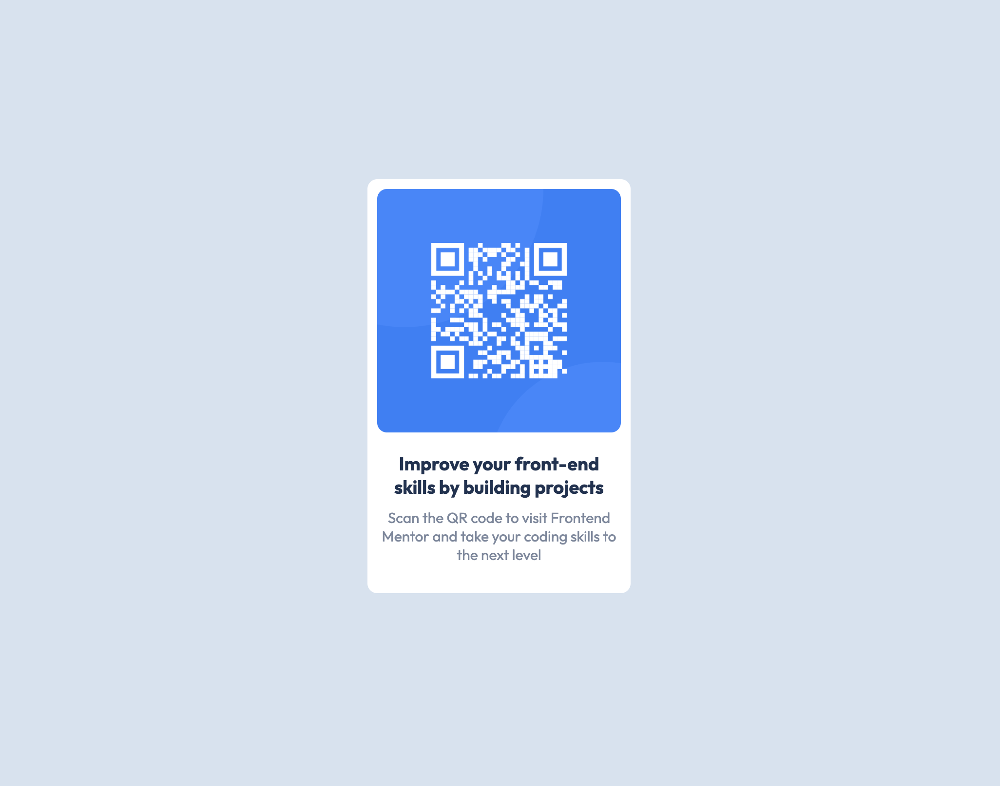

# Frontend Mentor - QR code component solution

This is a solution to the [QR code component challenge on Frontend Mentor](https://www.frontendmentor.io/challenges/qr-code-component-iux_sIO_H). Frontend Mentor challenges help you improve your coding skills by building realistic projects.

## Table of contents

- [Overview](#overview)
  - [Screenshot](#screenshot)
  - [Links](#links)
- [My process](#my-process)
  - [Built with](#built-with)
  - [What I learned](#what-i-learned)
  - [Continued development](#continued-development)
  - [Useful resources](#useful-resources)
- [Author](#author)
- [Acknowledgments](#acknowledgments)

## Overview

### Screenshot

### Built with

- Semantic HTML5 markup
- CSS custom properties
- Flexbox

### What I learned

Working on my CSS skills. I wanted to focus on flexbox and using CSS custom properties.

### Continued development

I want to continue to build on my CSS skills. Being able to look at a component/website and being able to make every part of it, getting as close to pixel perfect as possible.

## Author

- Website - [Alex Liebhaber](https://alexliebhaber.netlify.app/)
- Twitter - [@alex_liebhaber](https://www.twitter.com/alex_liebhaber)
